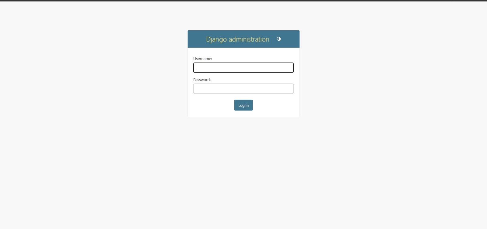
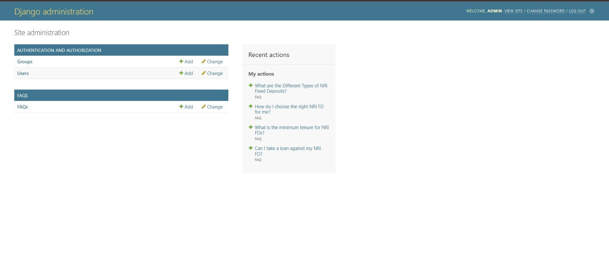
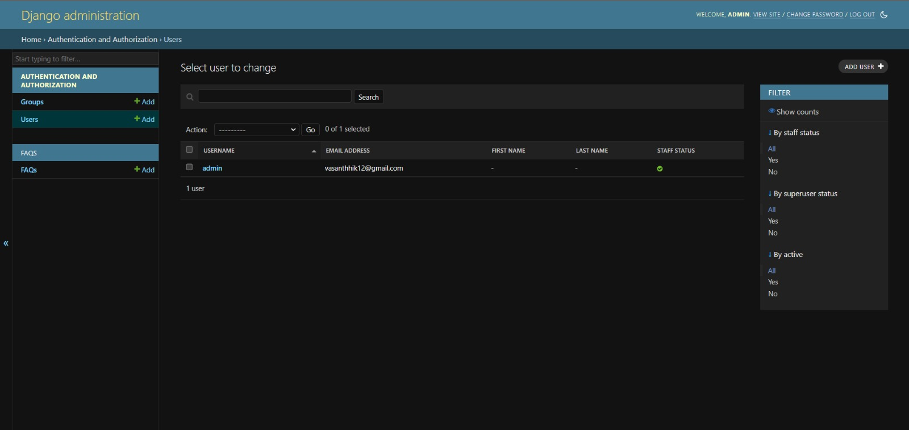
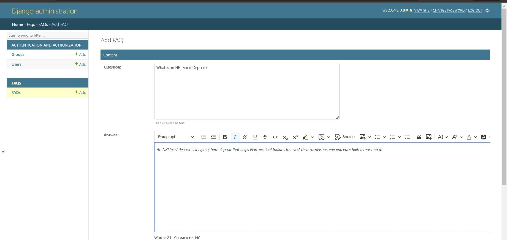
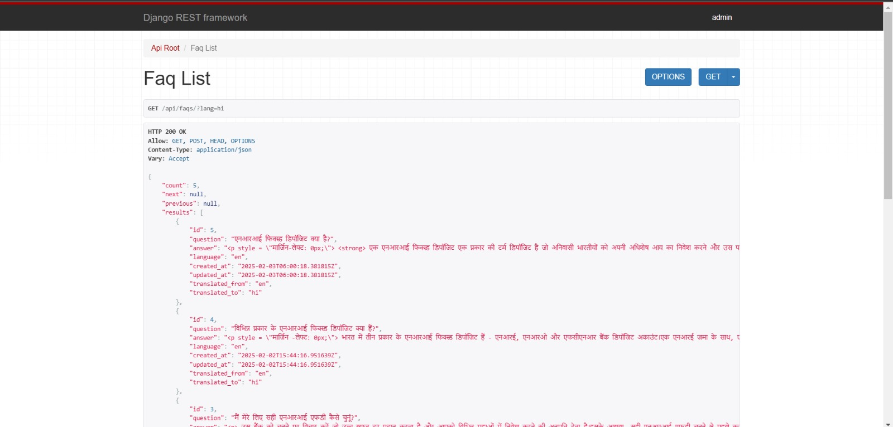

# Multilingual FAQ System

A Django-based FAQ management system with multilingual support, built using Django REST Framework and CKEditor 5.

### Core Features
- **Multilingual Support**
  - Support for 30+ languages including:
    - Indian languages (Hindi, Bengali, Telugu, Tamil, etc.)
    - European languages (Spanish, French, German, etc.)
    - Asian languages (Chinese, Japanese, Korean, etc.)
  - Automatic translation using Google Translate
  - Language fallback to English when translation is unavailable

### Content Management
- **Rich Text Editing**
  - Modern WYSIWYG editor (CKEditor 5)
  - Support for text formatting, lists, and links
  - Image upload capabilities
  - Clean and valid HTML output



### API Features
- **RESTful API**
  - Language selection via query parameters
  - JSON responses with translated content
  - Pagination support
  - Filter and search capabilities

### Performance
- **Caching System**
  - Translation caching for 24 hours
  - Reduced API calls to translation service
  - Improved response times

### Admin Interface
- **User-friendly Admin Panel**
  - Easy FAQ management
  - Preview translations
  - Rich text editing support
  - Bulk actions support


## Technologies Used

### Backend
- **Django 5.1.5**
  - High-level Python web framework
  - ORM for database operations
  - Admin interface

- **Django REST Framework**
  - API development
  - Serialization
  - Authentication
  - Viewsets and routers

### Database
- **SQLite** (default)
  - Lightweight database
  - Zero configuration required
  - Suitable for development and small to medium deployments

### Editor
- **CKEditor 5**
  - Modern WYSIWYG editor
  - Customizable toolbar
  - Clean HTML output
  - Image upload support

### Translation
- **Google Translate**
  - Automatic translation
  - Support for 30+ languages
  - Fallback mechanisms


### Caching
- **Django's Cache Framework**
  - Memory-based caching
  - Translation result caching
  - Configurable cache timeout

### Testing
- **Django Test Framework**
  - Unit tests
  - API tests
  - Model tests
  - 
## Installation

1. Clone the repository:
```bash
git clone https://github.com/yourusername/multilingual-faq.git
cd multilingual-faq
```

2. Create and activate virtual environment:
```bash
python -m venv venv
source venv/bin/activate  # Linux/Mac
# OR
.\venv\Scripts\activate  # Windows
```

3. Install dependencies:
```bash
pip install -r requirements.txt
```

4. Run migrations:
```bash
python manage.py migrate
```

5. Create superuser:
```bash
python manage.py createsuperuser
```

6. Run the development server:
```bash
python manage.py runserver
```

Then you can run the application on http://127.0.0.1:8000/admin/ 

## API Usage

### List FAQs
```bash
GET /api/faqs/
```

### Get FAQ in specific language
```bash
GET /api/faqs/?lang=hi  # Hindi
GET /api/faqs/?lang=es  # Spanish
GET /api/faqs/?lang=fr  # French
```

### Create FAQ
```bash
POST /api/faqs/
Content-Type: application/json

{
    "question": "How do I use this API?",
    "answer": "<p>Just make a GET request!</p>",
    "language": "en"
}
```

### Update FAQ
```bash
PUT /api/faqs/{id}/
Content-Type: application/json

{
    "question": "Updated question",
    "answer": "<p>Updated answer</p>",
    "language": "en"
}
```


## Running Tests

```bash
python manage.py test
```

## Contributing

1. Fork the repository
2. Create your feature branch (`git checkout -b feature/amazing-feature`)
3. Commit your changes (`git commit -m 'feat: Add amazing feature'`)
4. Push to the branch (`git push origin feature/amazing-feature`)
5. Open a Pull Request
